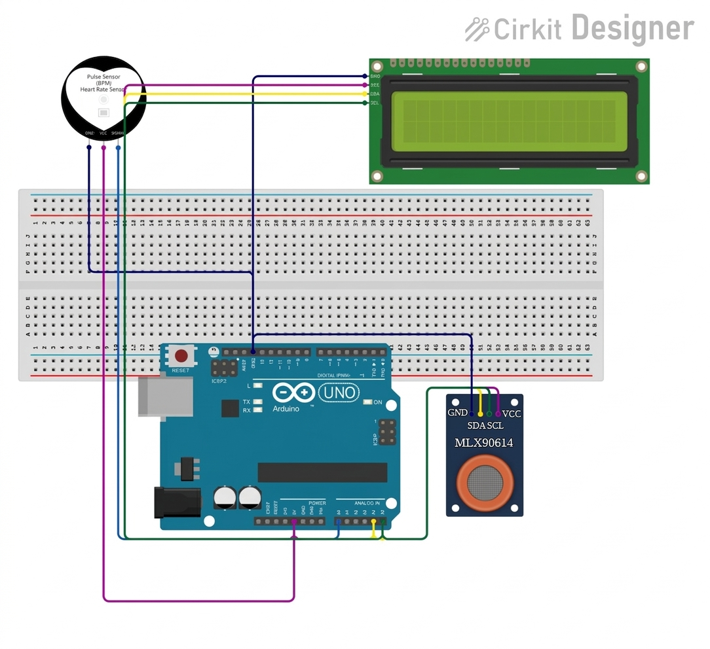
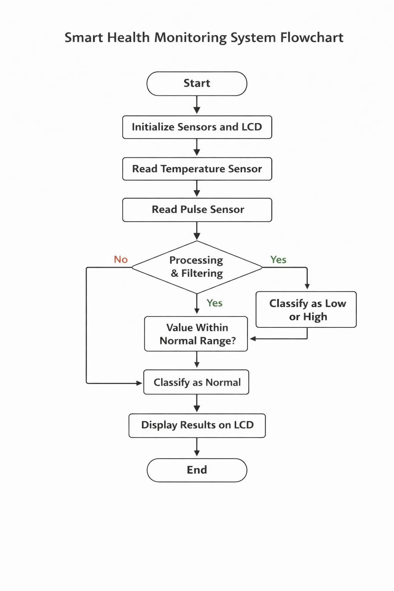

# Smart Health Monitoring System

**Course:** Embedded Systems  
**Semester:** 2026  
**Institution:** Al-Razi University  
**Submission Date:** January 26, 2026  
**Members:** Balqees Adel Jamil – 15

---

## Abstract

This project presents a real-time health monitoring system based on the Arduino Nano microcontroller. The system measures two primary vital signs: body temperature and heart rate. Temperature is detected using the MLX90614 Infrared Temperature Sensor (non-contact), and heart rate is measured using a Pulse Sensor.  

The system processes collected data using smoothing and filtering techniques to reduce noise and ensure stable readings. A peak detection algorithm calculates heart rate in beats per minute (BPM). Temperature and heart rate are classified into three categories:  

- Normal  
- Low  
- High  

The results are displayed in real-time on a 16x2 LCD via I2C, reducing wiring complexity. This system provides a low-cost, efficient, and expandable solution for basic health monitoring applications suitable for educational and prototype purposes.

---

## Introduction

### 1. Background and Motivation
Health monitoring systems are increasingly important due to the need for continuous, non-invasive monitoring. This project aims to design a simple yet efficient system that measures temperature and heart rate using affordable components.  

### 2. Problem Statement
Traditional health monitoring devices can be expensive and complex. This project provides a low-cost, simple, real-time system for vital signs monitoring.

### 3. Project Objectives
- Measure body temperature in real-time using a non-contact sensor  
- Measure heart rate (BPM) accurately using a pulse sensor  
- Display readings clearly on an LCD screen  
- Implement filtering to stabilize sensor readings  
- Classify readings into Normal, Low, and High  

### 4. Scope and Limitations
Focuses on basic vital sign monitoring, not intended for medical diagnosis. Operates as a prototype using Arduino Nano with limited processing power. Environmental noise may affect results.

---

## System Overview

### High-Level Description
The system collects data from temperature and heart rate sensors, processes signals using Arduino Nano, and displays results on an LCD screen in real time.

### Functional Description
- **Sensing:** Temperature and pulse detection  
- **Processing:** Signal filtering and BPM calculation  
- **Output:** LCD display  
- **Communication:** I2C protocol  

### Use-Case Scenario
Upon power-on, sensors start reading continuously. Arduino processes data and updates the LCD showing temperature and heart rate along with status (Normal, High, Low).

---

## Hardware Design

### Components List

| Component | Specification | Quantity |
|-----------|---------------|----------|
| Arduino Nano | ATmega328P | 1 |
| MLX90614 | Infrared Temperature Sensor | 1 |
| Pulse Sensor | Heart Rate Sensor | 1 |
| LCD 16x2 (I2C) | 0x27 Address | 1 |
| Jumper Wires | - | Several |

### Component Justification
Low-cost, widely supported components. MLX90614 allows accurate non-contact temperature readings; Pulse Sensor enables real-time heart rate detection. I2C LCD reduces wiring complexity.

### Power Considerations
Powered via USB (5V). Total current consumption is low, suitable for portable use.

###  Circuit Diagram

---

## Software Design

### Development Environment
- **Language:** C/C++  
- **IDE:** Arduino IDE  
- **Libraries:** Wire.h, LiquidCrystal_I2C.h, Adafruit_MLX90614.h  

### Software Architecture
Loop-based architecture: sensor readings continuously processed, filtered, and displayed.  

### Algorithms
- Signal smoothing (moving average filter)  
- Peak detection for BPM  
- Threshold-based classification

###  Flowchart

---

## System Integration
Hardware and software integrated via I2C for LCD and analog input for pulse sensor. Arduino processes data in real-time with minimal delay.

---

## Testing and Validation

### Testing Strategy
Observed real-time outputs and verified sensor responses under different conditions.

### Test Cases

| Test Case ID | Input / Condition | Expected Output | Actual Output | Status |
|--------------|-----------------|----------------|---------------|--------|
| TC-01 | Power On | System displays data | Working | Pass |
| TC-02 | Finger on sensor | BPM appears | Working | Pass |

---

## Results and Discussion
System measures and displays temperature and heart rate. Some fluctuations due to sensor noise; filtering improved stability.

---

## Challenges and Solutions
- **Challenge:** Noisy readings → **Solution:** Implemented smoothing filter  
- **Challenge:** Delayed BPM detection → **Solution:** Adjusted threshold and timing logic  

---

## Conclusion
Project successfully developed a real-time health monitoring system using Arduino Nano. System provides reliable measurements and displays effectively.

---

## Future Work
- Add wireless connectivity (Bluetooth/WiFi)  
- Improve accuracy with advanced filtering  
- Mobile app integration  

---

## References
1. MLX90614 Datasheet  
2. Arduino Official Documentation  
3. Sensor Library Documentation
